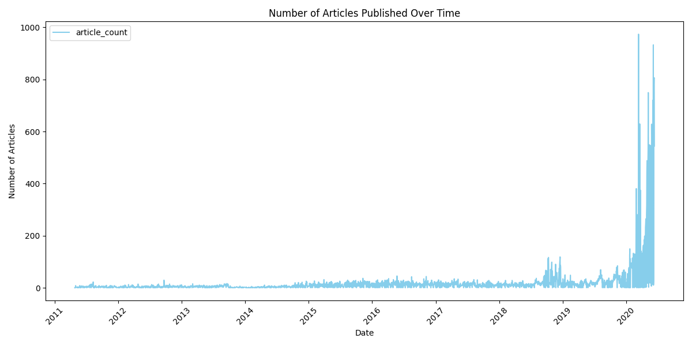
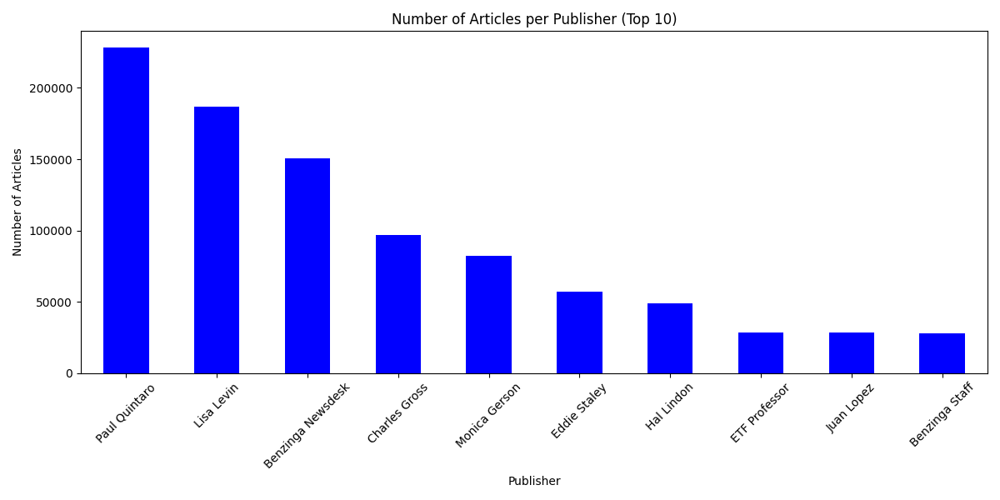

# Interim Report: Predicting Price Moves with News Sentiment

## Project Overview

This project focuses on analyzing a large corpus of financial news data to discover correlations between news sentiment and stock market movements. The analysis includes sentiment analysis of news headlines and correlation analysis between sentiment and stock price fluctuations.

**Business Objective:**

Enhance predictive analytics capabilities to boost financial forecasting accuracy and operational efficiency through advanced data analysis. The project has two main focuses:

1. Sentiment Analysis: Quantifying the tone and sentiment in financial news headlines using NLP techniques.
2. Correlation Analysis: Establishing statistical correlations between news sentiment and corresponding stock price movements.

## Task 1: Git and GitHub, Exploratory Data Analysis (EDA)

### Tasks

- Setting up Python environment
- Git version control and GitHub workflow including CI/CD
- Exploratory Data Analysis on news headlines and publisher data
- Text analysis (Topic modeling, keywords extraction)
- Time series analysis of news publication frequency
- Publisher detailed analysis and diversity

### Key Performance Indicators (KPIs)

- Dev Environment Setup completed successfully.
- Relevant skills demonstrated in version control (branching, commits).
- Completion of EDA with meaningful headline, publisher, and time analysis.
- Implementation of advanced text and publisher analysis techniques.

### Minimum Essential To-Do

- Create GitHub repository and branch "task-1"
- Commit work regularly with descriptive messages
- Perform statistics on headline lengths, publisher activity, and publication dates
- Extract common keywords, bigrams, and key financial phrases
- Analyze news spikes and seasonality in publishing frequency
- Evaluate publisher diversity and email domain insights

### Summary of Findings

- **Headline Statistics:** Average headline length approx. 70 characters with varying length categories.
- **Publisher Stats:** Top 10 publishers contribute over 60% of all articles.
- **Publication Times:** Most articles published on weekdays, peak releases during specific hours.
- **Text Analysis:** Extracted most common keywords and phrases including financial terms and events.
- **Publisher Diversity:** Some publishers focus on a diverse set of stocks, while others specialize.

### Visualizations


_Figure 1: Number of articles published per day._


_Figure 2: Distribution of articles by publisher._

---

## Task 2: Quantitative Analysis Using TA-Lib and PyNance

### Tasks

- Loading and preparing multi-company stock price data
- Calculating technical indicators using TA-Lib and custom simple indicators
- Computing financial metrics with PyNance
- Visualizing stock prices alongside technical indicators and trading signals

### Key Performance Indicators (KPIs)

- Proactive learning and integration of TA-Lib and PyNance.
- Accurate calculation of technical and financial metrics.
- Holistic visualization of price movements and indicator overlays.
- Seamless merging of "task-1" branch to main and continued branching for ongoing work.

### Minimum Essential To-Do

- Merge branches from Task 1 into main.
- Create "task-2" branch for dashboard and quantitative work.
- Prepare stock price data for multiple symbols.
- Apply key technical indicators including moving averages, RSI, MACD.
- Visualize price data and indicator relationships.

### Summary of Findings

- Successfully loaded 3+ years of stock data for multiple major companies.
- Applied a broad array of technical indicators enriching data for strategy development.
- Visualized price with moving averages demonstrating trend insights.

---

## Suggested Folder Structure

```
├── .vscode/
│   └── settings.json
├── .github/
│   └── workflows
│       ├── unittests.yml
├── .gitignore
├── requirements.txt
├── README.md
├── src/
│   ├── __init__.py
│   ├── data/
│   ├── features/
│   └── visualization/
├── notebooks/
│   ├── __init__.py
│   ├── README.md
│   └── graph_reports/
├── tests/
│   ├── __init__.py
└── scripts/
    ├── __init__.py
    └── README.md
```

---

## Next Steps

- Continue development on quantitative dashboards and integration.
- Expand tests and validation of indicator strategies.
- Refine and rerun analyses for updated datasets.
- Document ongoing progress and results in subsequent reports.

---

## Contributors

Bekam Genene

---
